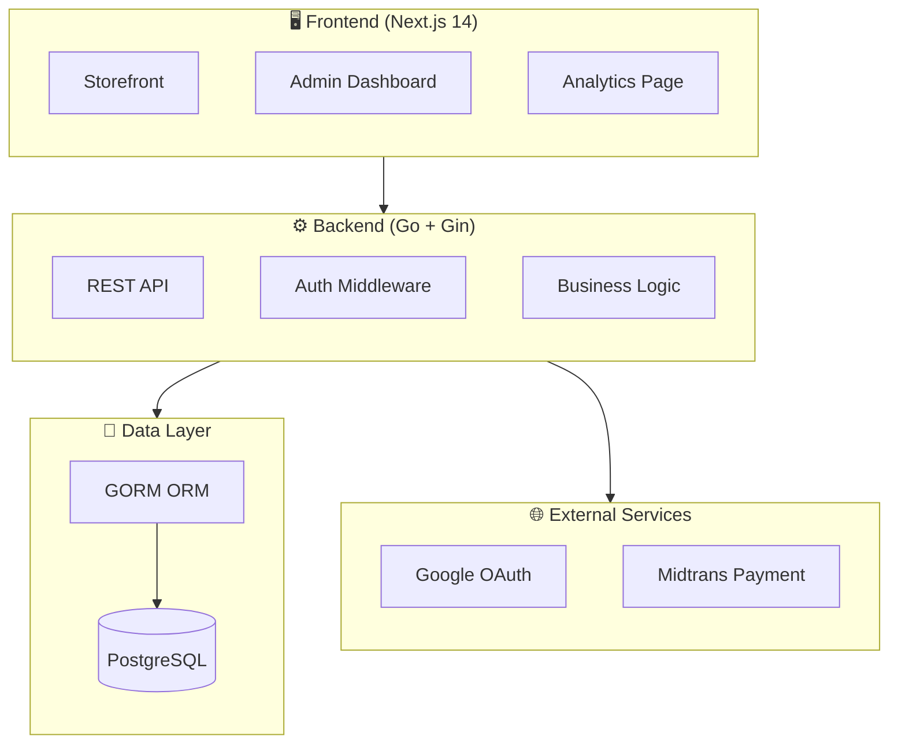

<p align="center">
  
  
  
  
  
</p>

<h1 align="center">🛒 Nexora E-Commerce Platform</h1>

<p align="center">
  <strong>A modern, full-stack e-commerce solution with premium dark UI design</strong>
</p>

<p align="center">
  <a href="#-features">Features</a> •
  <a href="#-tech-stack">Tech Stack</a> •
  <a href="#-getting-started">Getting Started</a> •
  <a href="#-api-reference">API Reference</a> •
  <a href="#-screenshots">Screenshots</a>
</p>

---

## 📖 Overview

**Nexora** is a high-performance, production-ready e-commerce platform designed for the Indonesian market. Built with a modern tech stack featuring **Next.js 14**, **Go**, and **PostgreSQL**, it delivers a seamless shopping experience with a stunning dark-themed UI.

### Why Nexora?

- 🎨 **Premium Dark Theme**: Glassmorphism effects, smooth animations, and fully responsive design
- ⚡ **Blazing Fast**: Server-side rendering with Next.js App Router and optimized Go backend
- 🔐 **Secure by Default**: OAuth 2.0 authentication, JWT sessions, and secure payment processing
- 📊 **Data-Driven**: Real-time analytics dashboard with Recharts visualization
- 🇮🇩 **Localized**: Indonesian Rupiah currency, local payment methods via Midtrans

---

## 🏗️ Architecture



---

## ✨ Features

### 🛍️ Customer Experience

| Feature | Description |
|---------|-------------|
| **Product Catalog** | Browse products with advanced filtering, search, and category navigation |
| **Product Details** | Image gallery, variant selection, stock status, and customer reviews |
| **Shopping Cart** | Persistent cart with quantity controls and real-time price calculation |
| **Wishlist** | Save favorite products for later with one-click add to cart |
| **Checkout Flow** | Multi-step checkout with address management and order summary |
| **Order Tracking** | Visual timeline with status updates and shipment tracking |
| **Guest Checkout** | Complete purchases without creating an account |

### �‍💼 Admin Panel

| Feature | Description |
|---------|-------------|
| **Dashboard** | Overview of orders, revenue, products, and users at a glance |
| **Analytics** | Interactive charts showing sales trends and top-selling products |
| **Product Management** | Full CRUD operations with image upload and variant support |
| **Category Management** | Organize products with custom icons and hierarchical categories |
| **Order Management** | Process orders, update status, and manage shipments |
| **User Management** | View and manage customer accounts and roles |
| **Low Stock Alerts** | Automatic notifications when products are running low |

### � Payment & Security

| Feature | Description |
|---------|-------------|
| **Midtrans Integration** | Support for bank transfer, e-wallets, and credit cards |
| **Google OAuth** | One-click sign in with Google accounts |
| **JWT Authentication** | Secure token-based session management |
| **Role-Based Access** | Separate permissions for customers and administrators |

---

## 🛠️ Tech Stack

### Frontend
| Technology | Purpose |
|------------|---------|
| **Next.js 14** | React framework with App Router and Server Components |
| **TypeScript** | Type-safe JavaScript for better developer experience |
| **Tailwind CSS** | Utility-first CSS framework for rapid UI development |
| **Lucide React** | Beautiful, consistent icon library |
| **Recharts** | Composable charting library for analytics visualization |

### Backend
| Technology | Purpose |
|------------|---------|
| **Go 1.21+** | High-performance, compiled programming language |
| **Gin Framework** | Fast HTTP web framework for Go |
| **GORM** | Full-featured ORM for database operations |
| **JWT-Go** | JSON Web Token implementation for authentication |

### Database & Services
| Technology | Purpose |
|------------|---------|
| **PostgreSQL** | Robust relational database with advanced features |
| **Google OAuth 2.0** | Secure third-party authentication |
| **Midtrans** | Indonesian payment gateway integration |

---

## 🚀 Getting Started

### Prerequisites

Ensure you have the following installed:

- **Go** 1.21 or higher
- **Node.js** 18 or higher
- **PostgreSQL** 15 or higher
- **Git**

### Installation

#### 1. Clone the Repository

```bash
git clone https://github.com/yourusername/nexora.git
cd nexora
```

#### 2. Database Setup

```sql
-- Connect to PostgreSQL and create database
CREATE DATABASE nexora;
```

#### 3. Backend Configuration

```bash
cd backend

# Copy environment template
cp .env.example .env

# Edit .env with your credentials
```

**Required Environment Variables:**

| Variable | Description | Example |
|----------|-------------|---------|
| `DB_HOST` | PostgreSQL host | `localhost` |
| `DB_PORT` | PostgreSQL port | `5432` |
| `DB_USER` | Database username | `postgres` |
| `DB_PASSWORD` | Database password | `your_password` |
| `DB_NAME` | Database name | `nexora` |
| `JWT_SECRET` | Secret key for JWT tokens | `your-secret-key-min-32-chars` |
| `GOOGLE_CLIENT_ID` | Google OAuth client ID | `xxx.apps.googleusercontent.com` |
| `GOOGLE_CLIENT_SECRET` | Google OAuth client secret | `GOCSPX-xxx` |
| `MIDTRANS_SERVER_KEY` | Midtrans server key | `SB-Mid-server-xxx` |
| `MIDTRANS_CLIENT_KEY` | Midtrans client key | `SB-Mid-client-xxx` |

```bash
# Install dependencies
go mod tidy

# Run the server
go run main.go
```

#### 4. Frontend Configuration

```bash
cd frontend

# Install dependencies
npm install

# Copy environment template
cp .env.example .env.local
```

**Frontend Environment Variables:**

| Variable | Description | Example |
|----------|-------------|---------|
| `NEXT_PUBLIC_API_URL` | Backend API URL | `http://localhost:8080/api` |
| `NEXT_PUBLIC_MIDTRANS_CLIENT_KEY` | Midtrans client key | `SB-Mid-client-xxx` |

```bash
# Run development server
npm run dev
```

#### 5. Seed Sample Data (Optional)

```bash
cd backend
go run cmd/seed/main.go
```

### Access the Application

| Service | URL |
|---------|-----|
| **Storefront** | http://localhost:3000 |
| **Admin Panel** | http://localhost:3000/admin |
| **API Server** | http://localhost:8080 |

---

## 📡 API Reference

### Authentication

| Method | Endpoint | Description |
|--------|----------|-------------|
| `GET` | `/api/auth/google` | Initiate Google OAuth flow |
| `GET` | `/api/auth/google/callback` | OAuth callback handler |
| `GET` | `/api/auth/me` | Get current user info |
| `POST` | `/api/auth/logout` | Logout and invalidate session |

### Products

| Method | Endpoint | Description |
|--------|----------|-------------|
| `GET` | `/api/products` | List products (with filters) |
| `GET` | `/api/products/:slug` | Get product by slug |
| `POST` | `/api/admin/products` | Create product (Admin) |
| `PUT` | `/api/admin/products/:id` | Update product (Admin) |
| `DELETE` | `/api/admin/products/:id` | Delete product (Admin) |

### Categories

| Method | Endpoint | Description |
|--------|----------|-------------|
| `GET` | `/api/categories` | List all categories |
| `POST` | `/api/admin/categories` | Create category (Admin) |
| `PUT` | `/api/admin/categories/:id` | Update category (Admin) |
| `DELETE` | `/api/admin/categories/:id` | Delete category (Admin) |

### Cart & Orders

| Method | Endpoint | Description |
|--------|----------|-------------|
| `GET` | `/api/cart` | Get user's cart |
| `POST` | `/api/cart` | Add item to cart |
| `PUT` | `/api/cart/:id` | Update cart item |
| `DELETE` | `/api/cart/:id` | Remove from cart |
| `GET` | `/api/orders` | Get user's orders |
| `POST` | `/api/orders` | Create new order |
| `GET` | `/api/orders/:id` | Get order details |

### Payments & Tracking

| Method | Endpoint | Description |
|--------|----------|-------------|
| `POST` | `/api/payments/:order_id` | Create payment |
| `POST` | `/api/tracking` | Track shipment (dummy) |
| `GET` | `/api/couriers` | Get available couriers |

---

## � Project Structure

```
nexora/
├── 📁 backend/                 # Go API Server
│   ├── 📁 cmd/
│   │   └── 📁 seed/           # Database seeder
│   ├── 📁 config/             # Configuration & DB connection
│   ├── 📁 handlers/           # API route handlers
│   │   ├── auth.go            # Authentication
│   │   ├── products.go        # Product CRUD
│   │   ├── orders.go          # Order management
│   │   ├── tracking.go        # Shipment tracking
│   │   └── ...
│   ├── 📁 middleware/         # Auth & CORS middleware
│   ├── 📁 models/             # GORM database models
│   ├── main.go                # Entry point
│   └── .env.example           # Environment template
│
├── 📁 frontend/               # Next.js 14 Application
│   ├── 📁 app/
│   │   ├── 📁 (store)/        # Customer-facing pages
│   │   │   ├── page.tsx       # Homepage
│   │   │   ├── 📁 products/   # Product pages
│   │   │   ├── 📁 cart/       # Shopping cart
│   │   │   ├── 📁 checkout/   # Checkout flow
│   │   │   ├── 📁 orders/     # Order history
│   │   │   └── 📁 account/    # User account
│   │   └── 📁 admin/          # Admin dashboard
│   │       ├── page.tsx       # Dashboard
│   │       ├── 📁 analytics/  # Analytics charts
│   │       ├── 📁 products/   # Product management
│   │       ├── 📁 categories/ # Category management
│   │       └── 📁 orders/     # Order management
│   ├── 📁 components/         # Reusable components
│   │   ├── 📁 ui/             # Base UI components
│   │   ├── 📁 product/        # Product components
│   │   └── 📁 layout/         # Layout components
│   ├── 📁 lib/                # Utilities & API client
│   └── 📁 styles/             # Global styles
│
└── README.md                  # This file
```

---

## 🎨 Design System

### Color Palette

| Color | Hex | Usage |
|-------|-----|-------|
| **Primary** | `#6366F1` | Buttons, links, accents |
| **Secondary** | `#F97316` | Highlights, CTAs |
| **Background** | `#0F172A` | Main background |
| **Surface** | `#1E293B` | Cards, modals |
| **Border** | `#334155` | Dividers, borders |

### Typography

- **Display**: Plus Jakarta Sans (headings)
- **Body**: Inter (paragraphs, UI)

---

## 🤝 Contributing

Contributions are welcome! Please follow these steps:

1. Fork the repository
2. Create a feature branch (`git checkout -b feature/amazing-feature`)
3. Commit your changes (`git commit -m 'Add amazing feature'`)
4. Push to the branch (`git push origin feature/amazing-feature`)
5. Open a Pull Request

---

## 📄 License

This project is licensed under the **MIT License** - see the [LICENSE](LICENSE) file for details.

---

<p align="center">
  Made with ❤️ for the future of E-Commerce
</p>
